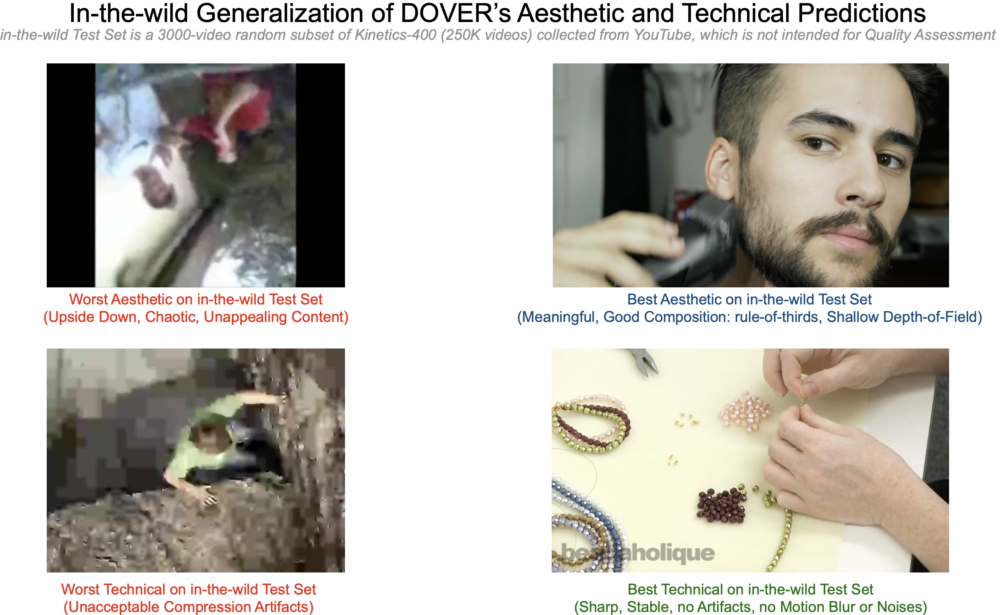
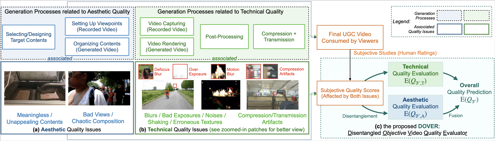
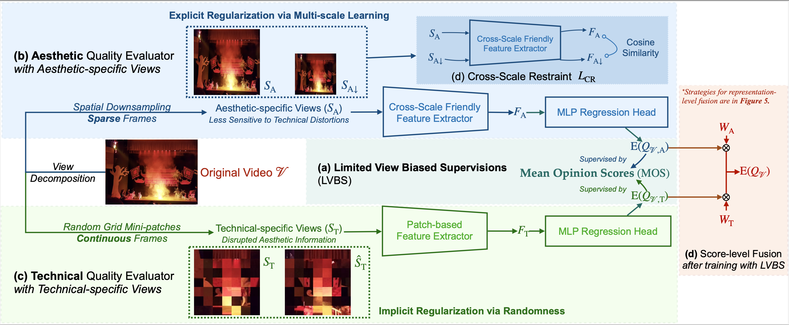

# DOVER

Official Code for [ICCV2023] Paper *"Exploring Video Quality Assessment on User Generated Contents from Aesthetic and Technical Perspectives"*. 
Official Code, Demo, Weights for the [Disentangled Objective Video Quality Evaluator (DOVER)](arxiv.org/abs/2211.04894).

- 22 Nov, 2023: We upload weights of [DOVER](https://huggingface.co/teowu/DOVER/resolve/main/DOVER.pth?download=true) and [DOVER++](https://huggingface.co/teowu/DOVER/resolve/main/DOVER_plus_plus.pth?download=true) to Hugging Face models.
- 21 Nov, 2023: The release note of [DIVIDE database](get_divide_dataset/) is updated. 
- 1 Aug, 2023: ONNX conversion script for DOVER has been released. Short tip: after installation, run [this](https://github.com/VQAssessment/DOVER/blob/master/convert_to_onnx.py) and then [this](https://github.com/VQAssessment/DOVER/blob/master/onnx_inference.py).
- 17 Jul, 2023: DOVER has been accepted by ICCV2023.
- 9 Feb, 2023: **DOVER-Mobile** is available! Evaluate on CPU with Very High Speed!
- 16 Jan, 2023: Full Training Code Available (include LVBS). See below.
- 10 Dec, 2022: Now the evaluation tool can directly predict a fused score for any video. See [here](https://github.com/QualityAssessment/DOVER#new-get-the-fused-quality-score-for-use).


 [](https://github.com/QualityAssessment/DOVER)
[](https://github.com/QualityAssessment/DOVER)
<a href="https://colab.research.google.com/github/taskswithcode/DOVER/blob/master/TWCDOVER.ipynb"></a> 


**DOVER** Pseudo-labelled Quality scores of [Kinetics-400](https://www.deepmind.com/open-source/kinetics): [CSV](https://github.com/QualityAssessment/DOVER/raw/master/dover_predictions/kinetics_400_1.csv)

**DOVER** Pseudo-labelled Quality scores of [YFCC-100M](http://projects.dfki.uni-kl.de/yfcc100m/): [CSV](https://github.com/QualityAssessment/DOVER/raw/master/dover_predictions/yfcc_100m_1.csv)


[](https://paperswithcode.com/sota/video-quality-assessment-on-konvid-1k?p=disentangling-aesthetic-and-technical-effects)
[](https://paperswithcode.com/sota/video-quality-assessment-on-live-fb-lsvq?p=disentangling-aesthetic-and-technical-effects)
[](https://paperswithcode.com/sota/video-quality-assessment-on-live-vqc?p=disentangling-aesthetic-and-technical-effects)
[](https://paperswithcode.com/sota/video-quality-assessment-on-youtube-ugc?p=disentangling-aesthetic-and-technical-effects)




Corresponding video results can be found [here](https://github.com/QualityAssessment/DOVER/tree/master/figs).


## Introduction


*In-the-wild UGC-VQA is entangled by aesthetic and technical perspectives, which may result in different opinions on the term **QUALITY**.*



### the proposed DOVER

*This inspires us to propose a simple and effective way to disengtangle the two perspectives from **EXISTING** UGC-VQA datasets.*



### DOVER or DOVER-Mobile

DOVER-Mobile changes the backbone of two branches in DOVER into `convnext_v2_femto` (inflated). The whole DOVER-Mobile has only **9.86M** (5.7x less than DOVER) parameters, **52.3GFLops** (5.4x less than DOVER), and less than **1.9GB graphic memory cost** (3.1x less than DOVER) during inference.

The speed on CPU is also much faster (**1.4s** vs 3.6s per video, on our test environment).

Results comparison:
|  Metric: PLCC    | KoNViD-1k | LIVE-VQC | LSVQ_test | LSVQ_1080p | Speed on CPU |
| ----  |    ----   |   ----  |      ----     |   ----  | ---- |
| [**DOVER**](https://github.com/QualityAssessment/DOVER/releases/download/v0.1.0/DOVER.pth) | 0.883 | 0.854 | 0.889 | 0.830 | 3.6s |
| [**DOVER-Mobile**](https://github.com/QualityAssessment/DOVER/releases/download/v0.5.0/DOVER-Mobile.pth) | 0.853 | 0.835 | 0.867 | 0.802 | **1.4s**:rocket: |
| BVQA (Li *et al*, TCSVT 2022) | 0.839 | 0.824 | 0.854 | 0.791 | >300s |
| Patch-VQ (Ying *et al, CVPR 2021) | 0.795 | 0.807 | 0.828 | 0.739 | >100s |

To switch to DOVER-Mobile, please add `-o dover-mobile.yml` at the end of any of following scripts (train, test, validate).


## Install

The repository can be installed via the following commands:
```shell
git clone https://github.com/QualityAssessment/DOVER.git 
cd DOVER 
pip install -e .  
mkdir pretrained_weights 
cd pretrained_weights 
wget https://github.com/QualityAssessment/DOVER/releases/download/v0.1.0/DOVER.pth 
wget https://github.com/QualityAssessment/DOVER/releases/download/v0.5.0/DOVER-Mobile.pth
cd ..
```

## Tip to Download LSVQ

```python
import os, glob

snapshot_download("teowu/LSVQ-videos", repo_type="dataset", local_dir="./", local_dir_use_symlinks=False)

gz_files = glob.glob("*.tar.gz")

for gz_file in gz_files:
    print(gz_file)
    os.system("tar -xzf {}".format(gz_file))
```

## Evaluation: Judge the Quality of Any Video

### New! ONNX Conversion is available

We have now supported to convert to ONNX, which can easily be deployed to a wide range of devices.

After the installation above, you can do this with a single step:

```shell
python convert_to_onnx.py
```

You may infer with ONNX as follows.

```shell
python onnx_inference.py -v ./demo/17734.mp4
```


### Try on Demos


You can run a single command to judge the quality of the demo videos in comparison with videos in VQA datasets. 

```shell
    python evaluate_one_video.py -v ./demo/17734.mp4 -f
```

or 

```shell
    python evaluate_one_video.py -v ./demo/1724.mp4 -f
```

You can also remove the `-f` to get the relative aesthetic and technical ranks in common UGC-VQA databases. 


### Evaluate on your customized videos


Or choose any video you like to predict its quality:


```shell
    python evaluate_one_video.py -v $YOUR_SPECIFIED_VIDEO_PATH$ -f
```

### Outputs

#### ITU-Standarized Overall Video Quality Score

The script can directly score the video's overall quality (considering both perspectives) between [0,1].

```shell
    python evaluate_one_video.py -v $YOUR_SPECIFIED_VIDEO_PATH$
```

The final output score is normalized and converted via ITU standards.

#### Old-Behaviour: Relative Aesthetic/Technical Ranks

You should get some outputs as follows if you remove the `-f`. As different datasets have different scales, an absolute video quality score is useless, but the comparison on both **aesthetic** and **technical quality** between the input video and all videos in specific sets are good indicators for how good the quality of the video is.

In the current version, you can get the analysis of the video's quality as follows (the normalized scores are following `N(0,1)`, so you can expect scores > 0 are related to better quality).


```
Compared with all videos in the LIVE_VQC dataset:
-- the technical quality of video [./demo/17734.mp4] is better than 43% of videos, with normalized score 0.10.
-- the aesthetic quality of video [./demo/17734.mp4] is better than 64% of videos, with normalized score 0.51.
Compared with all videos in the KoNViD-1k dataset:
-- the technical quality of video [./demo/17734.mp4] is better than 75% of videos, with normalized score 0.77.
-- the aesthetic quality of video [./demo/17734.mp4] is better than 91% of videos, with normalized score 1.21.
Compared with all videos in the LSVQ_Test dataset:
-- the technical quality of video [./demo/17734.mp4] is better than 69% of videos, with normalized score 0.59.
-- the aesthetic quality of video [./demo/17734.mp4] is better than 79% of videos, with normalized score 0.85.
Compared with all videos in the LSVQ_1080P dataset:
-- the technical quality of video [./demo/17734.mp4] is better than 53% of videos, with normalized score 0.25.
-- the aesthetic quality of video [./demo/17734.mp4] is better than 54% of videos, with normalized score 0.25.
Compared with all videos in the YouTube_UGC dataset:
-- the technical quality of video [./demo/17734.mp4] is better than 71% of videos, with normalized score 0.65.
-- the aesthetic quality of video [./demo/17734.mp4] is better than 80% of videos, with normalized score 0.86.
```


## Evaluate on a Set of Unlabelled Videos


```shell
    python evaluate_a_set_of_videos.py -in $YOUR_SPECIFIED_DIR$ -out $OUTPUT_CSV_PATH$
```

The results are stored as `.csv` files in dover_predictions in your `OUTPUT_CSV_PATH`.

Please feel free to use DOVER to pseudo-label your non-quality video datasets.


## Data Preparation

We have already converted the labels for most popular datasets you will need for Blind Video Quality Assessment,
and the download links for the **videos** are as follows:

:book: LSVQ: [Github](https://github.com/baidut/PatchVQ)

:book: KoNViD-1k: [Official Site](http://database.mmsp-kn.de/konvid-1k-database.html)

:book: LIVE-VQC: [Official Site](http://live.ece.utexas.edu/research/LIVEVQC)

:book: YouTube-UGC: [Official Site](https://media.withyoutube.com)

*(Please contact the original authors if the download links were unavailable.)*

After downloading, kindly put them under the `../datasets` or anywhere but remember to change the `data_prefix` respectively in the [config file](dover.yml).


## Dataset-wise Default Inference

To test the pre-trained DOVER on multiple datasets, please run the following shell command:

```shell
    python default_infer.py
```

# Training: Adapt DOVER to your video quality dataset!

Now you can employ ***head-only/end-to-end transfer*** of DOVER to get dataset-specific VQA prediction heads. 

We still recommend **head-only** transfer. As we have evaluated in the paper, this method has very similar performance with *end-to-end transfer* (usually 1%~2% difference), but will require **much less** GPU memory, as follows:

```shell
    python transfer_learning.py -t $YOUR_SPECIFIED_DATASET_NAME$
```

For existing public datasets, type the following commands for respective ones:

- `python transfer_learning.py -t val-kv1k` for KoNViD-1k.
- `python transfer_learning.py -t val-ytugc` for YouTube-UGC.
- `python transfer_learning.py -t val-cvd2014` for CVD2014.
- `python transfer_learning.py -t val-livevqc` for LIVE-VQC.


As the backbone will not be updated here, the checkpoint saving process will only save the regression heads with only `398KB` file size (compared with `200+MB` size of the full model). To use it, simply replace the head weights with the official weights [DOVER.pth](https://github.com/teowu/DOVER/releases/download/v0.1.0/DOVER.pth).

We also support ***end-to-end*** fine-tune right now (by modifying the `num_epochs: 0` to `num_epochs: 15` in `./dover.yml`). It will require more memory cost and more storage cost for the weights (with full parameters) saved, but will result in optimal accuracy.

Fine-tuning curves by authors can be found here: [Official Curves](https://wandb.ai/timothyhwu/DOVER) for reference.


## Visualization

### Divergence Maps

Please follow the instructions in [Generate_Divergence_Maps_and_gMAD.ipynb](Generate_Divergence_Maps_and_gMAD.ipynb) to generate them.
You can also get to visualize the videos (but you need to download the data first).

### WandB Training and Evaluation Curves

You can be monitoring your results on WandB!
Though training codes will only be released upon the paper's acceptance, you may consider to modify the [FAST-VQA's fine-tuning scripts](https://github.com/teowu/FAST-VQA-and-FasterVQA/blob/dev/split_train.py) as we have done to reproduce the results.

Or, just take a look at our training curves that are made public: 

[Official Curves](https://wandb.ai/timothyhwu/DOVER)

and welcome to reproduce them!


## Acknowledgement

Thanks for every participant of the subjective studies!

## Citation

Should you find our work interesting and would like to cite it, please feel free to add these in your references! 


```bibtex
%fastvqa
@inproceedings{wu2022fastvqa,
  title={FAST-VQA: Efficient End-to-end Video Quality Assessment with Fragment Sampling},
  author={Wu, Haoning and Chen, Chaofeng and Hou, Jingwen and Liao, Liang and Wang, Annan and Sun, Wenxiu and Yan, Qiong and Lin, Weisi},
  booktitle ={Proceedings of European Conference of Computer Vision (ECCV)},
  year={2022}
}

%dover
@inproceedings{wu2023dover,
      title={Exploring Video Quality Assessment on User Generated Contents from Aesthetic and Technical Perspectives}, 
      author={Wu, Haoning and Zhang, Erli and Liao, Liang and Chen, Chaofeng and Hou, Jingwen Hou and Wang, Annan and Sun, Wenxiu Sun and Yan, Qiong and Lin, Weisi},
      year={2023},
      booktitle={International Conference on Computer Vision (ICCV)},
}


@misc{end2endvideoqualitytool,
  title = {Open Source Deep End-to-End Video Quality Assessment Toolbox},
  author = {Wu, Haoning},
  year = {2022},
  url = {http://github.com/timothyhtimothy/fast-vqa}
}
```
